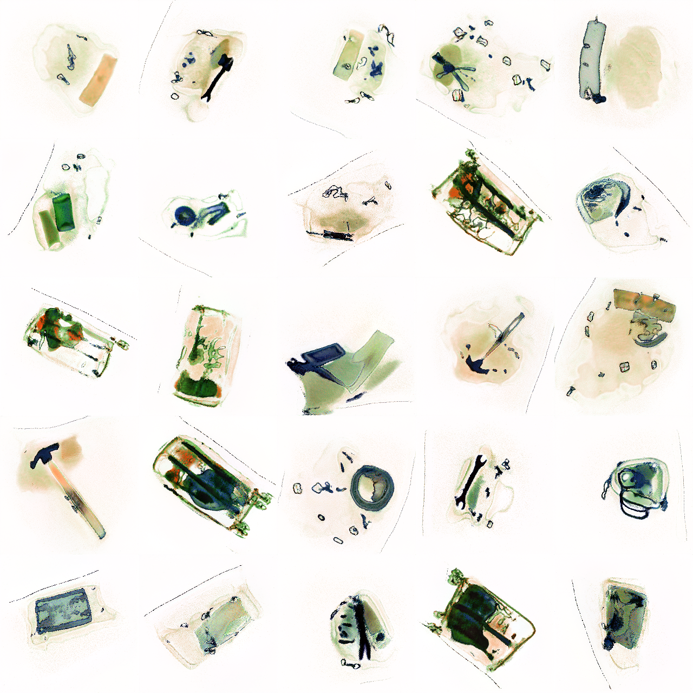

## BagGAN -Synthetic Baggage Scan Generation with StyleGAN2-ADA

A Python library for StyleGAN-based generation of synthetic baggage X-ray images for prohibited item detection.

The package consists of a [StyleGAN2-ADA](https://github.com/NVlabs/stylegan2-ada-pytorch) model designed to simulate baggage X-ray/CT scans for airport security screening. The training and testing scripts in the open-source package are used to train the model on the [PIDRay](https://arxiv.org/abs/2211.10763) benchmark which can be downloaded from this [link](https://github.com/bywang2018/security-dataset). The dataset consists of ~47,000 samples of baggage scans packed with 14 different prohibited items for airport security inspection. 



The model has been used to create a framework for generating annotated baggage X-ray scans for security inspection. The framework has been described in our paper: [Self-Supervised One-Shot Learning for Automatic Segmentation of StyleGAN Images](https://arxiv.org/pdf/2303.05639.pdf). The code for the same can be found in this [repo](https://github.com/avm-debatr/ganecdotes).

For access to the complete code containing pre-trained models for other baggage X-ray datasets and with additional functionalities, please contact the authors.

### Requirements

- Python3 (>v3.7.8)
- PyTorch (>v1.7.1)
- torchvision (>v0.8.2)
- CUDA (>v9.2)

### Setup and Installation

The code package can be cloned from the git repository using:

```bash
> git clone https://github.com/avm-debatr/bagganhq.git
```

Before running the scripts, the conda environment for the code can be created using the `environment.yaml` file provided with the scripts.

```bash
> cd bagganhq
> conda env create --name bagenv --file=environment.yaml
> conda activate bagenv
```

To use the presaved models for BagGAN, the user can download the contents from this [link](https://engineering.purdue.edu/RVL/ganecdotes/pidray_baggan.tar.gz) and copy them in `checkpoints/` directory.

### Usage
To train the BagGAN model from a scratch, the user can run the following code:

```bash
> python train.py --config=configs/config_pidray_ds_train.py --out_dir=results/pidray_baggan --ds=<path-to-PIDRay-dataset>
```

In order to run the script, the user must download the PIDRay dataset and specify its path using the `--ds` argument.

The model, dataset and training parameters are specified in a `config.py` file whose path is specified using the `--config` argument. Examples for reference are provided in the `configs/` directory. 


To test the BagGAN model from a scratch, the user can run the following code:

```bash
> python test.py --config=configs/config_pidray_ds_test.py --out_dir=results/pidray_baggan --ds=<path-to-PIDRay-dataset>
```

In order to run the script, the user will download the PIDRay dataset and specify its path using the `--ds` argument.

The model, dataset and training parameters are specified in a `config.py` file whose path is specified using the `--config` argument. Examples for reference are provided in the `configs/` directory. 

#### License
Public Domain, Copyright © 2023, Robot Vision Lab, Purdue University.

### Citation

```
@article{manerikar2023self,
  title={Self-Supervised One-Shot Learning for Automatic Segmentation of StyleGAN Images},
  author={Manerikar, Ankit and Kak, Avinash C},
  journal={arXiv preprint arXiv:2303.05639},
  year={2023}
}

```

### Contact

The authors can be contacted at:  amanerik@purdue.edu (Ankit Manerikar)
